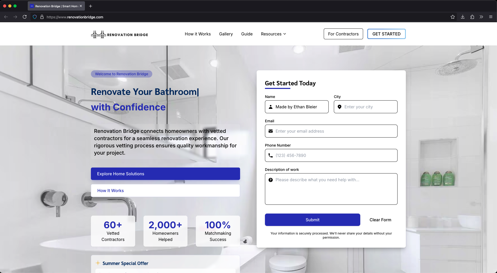

# [Renovation Bridge](https://renovationbridge.com)

> A full-stack web application connecting homeowners with contractors for seamless renovation experiences

<div align="center">
  
  
  <div style="display: flex; flex-wrap: wrap; gap: 15px; justify-content: center;">
    
    
  </div>
</div>

## Tech

- **Frontend**: React 18, Next.js 14.2+, Tailwind CSS 3.4+, Framer Motion 12.5+
- **State Management**: React Context API, Custom Hooks
- **Form Handling**: React Hook Form 7.50+ with validation
- **Authentication**: JWT implementation with bcrypt.js
- **Data Fetching**: Custom GraphQL client with GraphQL Request
- **Testing**: Jest, React Testing Library, Playwright for E2E testing
- **Performance Optimization**: Incremental Static Regeneration, Image optimization with Sharp
- **SEO**: Structured data (JSON-LD), Dynamic meta tags, Automated sitemap generation
- **CI/CD**: GitHub Actions workflows
- **Deployment**: Vercel integration

## Other Good Stuff

- **Modular Architecture** - Implemented feature-based code organization for enhanced maintainability and scalability
- **Server-Side Rendering** - Utilized Next.js SSR for improved SEO and initial page load performance
- **Responsive Design System** - Created a custom design system with consistent components and theming
- **Custom Image Gallery** - Built a responsive image gallery with lightbox functionality from scratch
- **In-Memory Data Layer** - Developed a custom data layer with UUID-based entity management
- **SEO Optimization** - Implemented advanced SEO techniques resulting in improved search ranking
- **Accessibility** - WCAG 2.1 AA compliant with keyboard navigation and screen reader support

## 📁 Map

```
renovationbridge/
├── public/               # Static assets
├── src/
│   ├── app/              # Next.js App Router pages
│   │   ├── api/          # API routes
│   │   ├── blog/         # Blog posts
│   │   ├── resources/    # Resource pages
│   │   ├── gallery/      # Gallery pages
│   │   ├── projects/     # Project pages
│   │   └── ...           # Other page routes
│   ├── components/       # Reusable UI components
│   │   ├── forms/        # Form components
│   │   ├── layout/       # Layout components
│   │   ├── sections/     # Page sections
│   │   ├── seo/          # SEO components
│   │   └── ui/           # UI elements
│   ├── features/         # Feature-based modules
│   │   └── gallery/      # Gallery feature module
│   ├── lib/              # Core functionality
│   │   ├── db/           # Database related
│   │   ├── models/       # Data models
│   │   ├── structured-data.ts # JSON-LD schema
│   │   └── seo-utils.ts  # SEO utilities
│   ├── styles/           # Global styles
│   ├── utils/            # Helper functions
│   └── __tests__/        # Tests
├── e2e/                  # End-to-end tests
├── scripts/              # Utility scripts
├── next-sitemap.config.js # Sitemap config
└── other config files
```

## Feature example: Gallery Module

Implemented a modular gallery system demonstrating clean architecture principles:

```typescript
// Example usage of the gallery feature module
import { 
  ImageGallery,
  ProjectGalleryTemplate,
  useGalleryProjects,
  useProjectDetails
} from '@/features/gallery';

export default function ProjectPage({ params }) {
  const { projectId } = params;
  const { project, isLoading } = useProjectDetails(projectId);
  
  return (
    <ProjectGalleryTemplate
      project={project}
      isLoading={isLoading}
      renderGallery={() => <ImageGallery images={project.images} />}
    />
  );
}
```


## Quick Start

```bash
# Install dependencies
npm install

# Run development server
npm run dev

# Build for production
npm run build

# Note: For more fun stuff, use my start.sh script
# Executable:
chmod +x scripts/start.sh

# Script:
./scripts/start.sh

# Run e2e test
npm run test:e2e
```

<!-- Contact Information -->
<div align="center">
  <p>Developed by <a href="https://ethanbleier.com">Ethan Bleier</a></p>
  <p>
    <a href="https://ethanbleier.com">Personal Website</a> |
    <a href="mailto:ebleier4@gmail.com">Email</a>
  </p>
</div>
